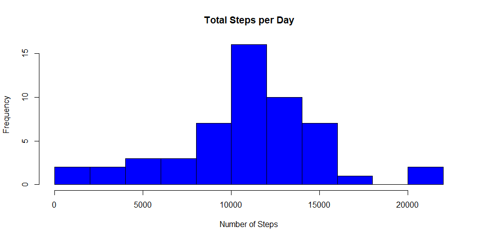
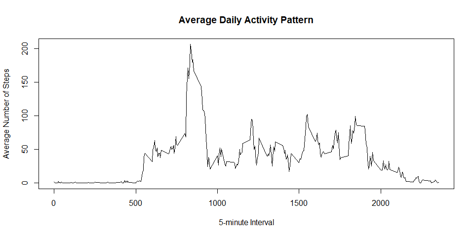
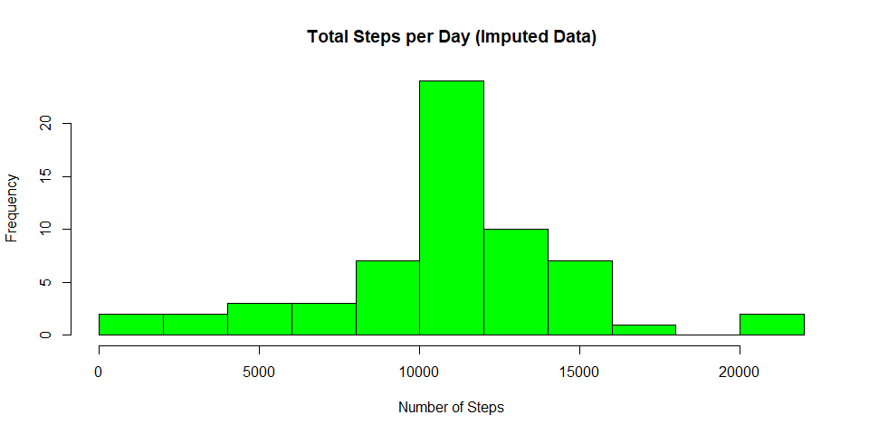
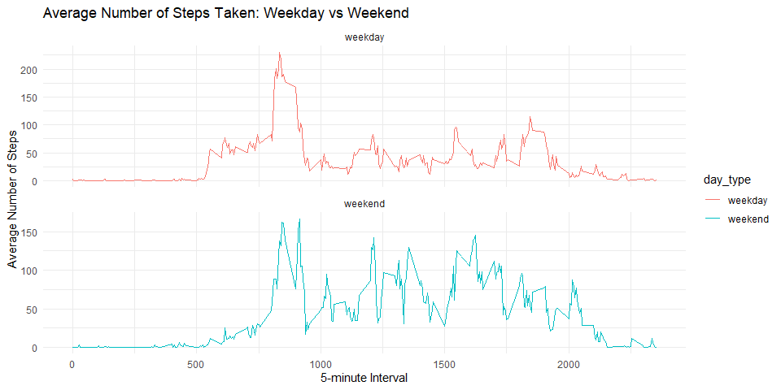

# Introduction

This report is for Project 1 of the Johns Hopkins Reproducible Research course offered on Coursera. 
It loads the required data set, performs some processing, and produces the plots to answer the following questions. 
The data set concerns the number of steps taken as recorded by a Fitbit or similar device.

## Questions to be answered:
1. What is the mean total number of steps taken per day?
2. What is the average daily activity pattern?
3. Imputing missing values.
4. Are there differences in activity patterns between weekdays and weekends?

## Setting Global Options


Set Working Directory to Source File Location


```r
library("rstudioapi") # Load rstudioapi package
setwd(dirname(getActiveDocumentContext()$path)) # Set working directory to source file location
getwd() # Check updated working directory
```

```
## [1] "C:/Users/ezc0066/OneDrive - Auburn University/Documents/AURelated/AUAcademic/StatCourseMaterial/Coursera/DataScience_JHU/C5_ReproducibleResearch/Week2/RepData_PeerAssessment1"
```

Loading packages


```r
library(ggplot2)
library(lubridate)  # for easy handling of dates
```

## Loading and preprocessing the data

Unzipping the file and reading it:


```r
unzip("activity.zip")
activity <- read.csv("activity.csv")
head(activity)
```

```
##   steps       date interval
## 1    NA 2012-10-01        0
## 2    NA 2012-10-01        5
## 3    NA 2012-10-01       10
## 4    NA 2012-10-01       15
## 5    NA 2012-10-01       20
## 6    NA 2012-10-01       25
```

## What is mean total number of steps taken per day?

Calculating the total number of steps taken per day, and visualizing it through a histogram. Also calculating the mean and median:


```r
tot_daily_steps <- aggregate(steps ~ date, data = activity, sum, na.rm = TRUE)
hist(tot_daily_steps$steps, main = "Total Steps per Day", xlab = "Number of Steps", 
     ylab = "Frequency", breaks = 15, col = "blue")
```

<!-- -->

```r
mn_steps <- mean(tot_daily_steps$steps)
med_steps <- median(tot_daily_steps$steps)
```

Mean of total number of steps taken per day: 10766.1886792

Median of total number of steps taken per day: 10765

## What is the average daily activity pattern?

Calculating and plotting the average number of steps for each 5-minute interval:


```r
ave_steps_int <- aggregate(steps ~ interval, data = activity, mean, na.rm = TRUE)
plot(ave_steps_int$interval, ave_steps_int$steps, type = "l", 
     xlab = "5-minute Interval", ylab = "Average Number of Steps", 
     main = "Average Daily Activity Pattern")
```

<!-- -->

```r
max_steps_int <- ave_steps_int[which.max(ave_steps_int$steps), ]
```

The 5-minute interval with the maximum number of steps on average is: 835

## Imputing missing values

Counting total missing values and imputing them:
Here, we use the mean for each 5-minute interval in imputing.


```r
tot_na <- sum(is.na(activity$steps))
mn_steps_int <- aggregate(steps ~ interval, data = activity, mean, na.rm = TRUE)
imp_activity <- activity
for (i in seq_along(imp_activity$steps)) {
  if (is.na(imp_activity$steps[i])) {
    imp_activity$steps[i] <- mn_steps_int$steps[which(mn_steps_int$interval == imp_activity$interval[i])]
  }
}
tot_daily_steps_imp <- aggregate(steps ~ date, data = imp_activity, sum)
hist(tot_daily_steps_imp$steps, main = "Total Steps per Day (Imputed Data)", 
     xlab = "Number of Steps", ylab = "Frequency", breaks = 15, col = "green")
```

<!-- -->

```r
mn_steps_imp <- mean(tot_daily_steps_imp$steps)
med_steps_imp <- median(tot_daily_steps_imp$steps)
```

Total number of missing values in the dataset: 2304

Mean of total number of steps taken per day (Imputed Data): 10766.1886792

Median of total number of steps taken per day (Imputed Data): 10766.1886792

These values differ only slightly from the estimates from the first part of the assignment.
Thus, the impact of imputing missing data on the estimates of the total daily number of steps
is moderate to minimal.

## Are there differences in activity patterns between weekdays and weekends?

Creating a factor variable for 'weekday' or 'weekend', calculating the average steps, 
and creating a panel plot:
To efficiently assess whether activity levels differ between weekdays and weekends, we can employ a straightforward approach: creating two separate graphs, one showcasing the data for weekdays and the other for weekends. By aligning these graphs vertically, we ensure that their $x$-axes match, allowing for a visual comparison. 


```r
imp_activity$date <- as.Date(imp_activity$date)
imp_activity$day_type <- 
    ifelse(weekdays(imp_activity$date) %in% c('Saturday', 'Sunday'), 'weekend', 'weekday')
imp_activity$day_type <- as.factor(imp_activity$day_type)

ave_steps_day_type <- aggregate(steps ~ interval + day_type, data = imp_activity, mean)

ggplot(ave_steps_day_type, aes(x = interval, y = steps, color = day_type)) +
    geom_line() +
    facet_wrap(~ day_type, ncol = 1, scales = "free_y") +
    labs(title = "Average Number of Steps Taken: Weekday vs Weekend",
         x = "5-minute Interval",
         y = "Average Number of Steps") +
    theme_minimal()
```

<!-- -->
